# Answers

## Software as a Service - Back-End Development

#

## Diploma of Information Technology (Advanced Programming)  

#

## Diploma of Information Technology (Back-End Development)

Replace GIVEN_NAME_HERE, FAMILY_NAME_HERE and STUDENT_ID_HERE entries with your details:

| Given Name | Family Name | Student ID  |
|------------|-------------|-------------|
| Anna       | Seed        | x1234567890 |
| Josef      | Meyer       | 20089460    |


# Declaration

I, Josef Meyer, by submitting this assessment, I am acknowledging the following:

- The submission is completely my own work.
- I have not used AI in the formuation of the answers within this assessment.
- I have acknowledged all sources of information used in this work (if required).
- I have kept a copy of this assessment (where practicable).
- I understand a copy of my assessment will be kept by TAFE for their records.
- I understand my assessment may be selected for use in the TAFEs validation and audit process
  to ensure student assessment meets requirements.

When submitting this assessment, I am accepting the above acknowledgement.

---

```table-of-contents
title: # Contents
style: nestedList
minLevel: 0
maxLevel: 3
includeLinks: true
```

---

# How to Answer Questions

Each time you answer a question, fill out the space provided for the answer to the question.

## Answer Requiring an Explanation

Answers to questions should be completed as "block quotes", replacing the `ANSWER_HERE` with the answer, and preceding each line with a greater than sign `>`. To add a new paragraph ensure you leave a `>` with no text after it.

Example:

```markdown
    

## Question Z - How many sofwarte developers does it take to change a lightbulb?
    
    > None. 
 > It is a hardware problem.
```

## Answer Requiring Code

When answering a question that requires code to be included, use a "code block", which starts with three back-ticks (/`) plus the language for the code (e.g. php, js, cpp, python, shell, text, et al).

Example:

```markdown
 

## Question X - Title

 Query Solution:

 ```js
 db.films.find();
 ```

```

> Note:
>
> The NoSQL code used to answer the question is contained in a code block,wich opens with three back-ticks (\`\`\`) followed by js, contains the code on the lines below, and ends with three back-ticks (\`\`\`) at the start of the next line after the code. An example is shown above.
>
> It is important that code blocks start at the beginning of the line for formatting on GitHub, Obsidian or your preferred IDE render the code correctly.

## Answer Requiring Image(s) to Be Inserted

Images are to be saved in a folder called "`assets`" and are embedded into the Markdown document.

Images for this assessment MUST be named in the form `step-X-Ya.ext` where:

- `X` is the step number (e.g. for step 5 the number is `5`)
- `Y` is the question dot number (e.g. for question `2.3` the dot number is `3` )
- `a` is an optional letter to allow for multiple images for an answer.
- `ext` is the filename extension (e.g. `png`, `jpg`, `jpeg`, `svg`, et al)

To insert an image use the following syntax:

```markdown

```

For example, the markdown code:

```markdown

```

Gives:


---


# Step 1: Setting Up for Assessment

This step provides a checklist for yout to ensure you have set up the assessment requirements as needed.


## Checklist

Put an X between each of the pairs of `[ ]` when you have completed the task:

> - [x] Create a new **empty** & **private** repository on GitHub (or the equivalent).
> - [ ] Repository is named
>    `xxx-ICT50220-SaaS-2-BED-NoSQL`
>    replacing `xxx` with your initials.  
>    **No:** name is
>    `jfm-ict50220-saas-2-bed-nosql-2026-s1`
>    (as suggested in instructions)
> - [x] Cloned the repository to your local PC.
> - [x] Created a new folder called `assets` inside your cloned repository.
> - [x] Created an empty `ReadMe.md`.
> - [x] Created an empty `.gitignore` file in the assets folder.
> - [x] Downloaded the provided `sample.gitignore` file, moved it into the repository folder, and renamed it to `.gitignore`.
> - [x] Placed a copy of the assessment's Word document into the repository folder.
> - [x] Added all the new files and folders to the repository, commited them to version control, and pushed them to your private remote repository.

---

# Step 2: NoSQL Systems

This step verifies you understand concepts that includes, but is not limited to such as databases, collections, fields, documents and naming conventions.

## 2.1 Defining Terms

Briefly explain what is meant by the terms database, collection, document and field in terms of MongoDB.

> A database consists of a group of collections, each of which hold a number of documents that hold similar
> information.  Each document may contain a number of key-value pairs, where the key-value pair represents a
> field.
>
> In SQL terms, a database would be a database, a collection would be a table, a document a row (or record)
> and a field a column (or field):
>
> | MongoDB    | SQL Equivalent | Purpose                                           |
> |------------|----------------|---------------------------------------------------|
> | database   | database       | Models entities relevant to the application       |
> | collection | table          | Holds information on a particular class of entity |
> | document   | row / record   | Holds information on a single entity [^1]         |
> | field      | column / field | Holds a piece of information about the entity     |
>
> [^1]: In MongoDB, fields may contain or refer to documents, in SQL only
> the latter is possible.

## 2.2 NoSQL Database Types

Briefly outline the key features and advantages for TWO of the following NoSQL database types:

- Document Database
- Key-Value Store
- Wide-Column Oriented Database
- Graph Database

## Database Type 1: Document Database
>
> This is the category that includes MongoDB.
>
> Advantages of document databases include:
>
> - Flexible schema, allowing differences in structure between items stored in the
>   same collection.  This allows the storage of semi-structured data, effectively permitting
>   a collection to store a number of different subtypes of the same general type of entity.
>
>   Flexible schema also support ad-hoc modifications and there is a better mapping between objects
>   at the application level and objects stored in the database.
>
> - Horizontal scalability: the combination of the ability to store more data in an object by
>   embedding related documents and the more relaxed guarantees of consistency in systems like
>   MondoDB makes implementing features like replication and sharding simpler than with SQL databases,
>   allowing storage and computation to be divided between many servers with more limited resources than
>   might be required by an SQL database of similar scale.

## Database Type 2: Key-Value Stores
>
> This is probably the simplest type of database after flat-file databases.
> Key-value stores do not necessarily impose a structure on what is stored.
> They essentially consist of a data structure that allows a value to be read or written using an
> associated "key" value.
> B-Trees or hash tables are commonly used for implementing such data-stores.
>
> The advantage of key-value stores is their extreme simplicity, which tends to be
> associated with low resource use and high speed.
> The obvious disadvantage is that they do not typically offer support for representing
> relationships between stored values.

## 2.3 NoSQL Database Systems

Provide one example product (commercial or open source) for each of your NoSQL NoSQL Database types.

You may **NOT** include _MongoDB_ which is an example of a _Document Database_.

> You just wanted an example?  I included several before realising that I wasn't actually expected to go into any detail
> describing them.  The references are to Wikipedia pages as I am not including any details that need backing up.

## Database Type 1: Document Database

> There are a number of popular document databases other than MongoDB: CouchDB, PouchDB (a JavaScript version of CouchDB),
> and Couchbase (which has a common origin with CouchDB, but has diverged significantly).

## Database Type 2: Key-value Store

> Key-value stores have been around for quite some time.
> Early(ish) examples include [DBM] and its successors NDBM, [GDBM], and [Berkeley DB][BDB].
> More recent implementations include [LDBM], [LevelDB], and in-memory stores like Redis.

[DBM]: https://en.wikipedia.org/wiki/DBM_%28computing%29
[BDB]: https://en.wikipedia.org/wiki/Berkeley_DB
[LDBM]: https://en.wikipedia.org/wiki/Lightning_Memory-Mapped_Database
[LevelDB]: https://en.wikipedia.org/wiki/LevelDB

## 2.4 NoSQL Database Uses

Provide an example for each of your NoSQL database of the situation when your database types may provide a benefit when used.

The situations/application of the database types must be different.

> #

## Database Type 1: Document Store

> Document stores are useful when the ability to make rapid changes to the data format is
> important (such as in rapid development / prototyping), where the information available
> may vary over time or according to the source (such as when recording time-series data
> from a rage of IoT devices), or when horizontal scalability and the associated fast access
> to data is more important than strict consistency (for example, in a messaging system or
> for use in website analytics).

## Database Type 2: Key-Value Store

> Key-value stores are useful in places where more powerful abstractions that support relationships
> between entities are not needed and speed or low resource use are essential.
> Embedded key-value stores are common, where the implementation is provided as a library that is linked
> into the executable.
>
> `Redis` is an extremely fast in-memory key-value store that is often used for caching and session
> management in web applications and similar contexts where fast responses are needed and the
> lifespan of the process serving a request is limited to the lifespan of a single request.
>
> `NDBM` (and relatives) are used in programs like `sendmail` for fast lookup of values when
> performing authentication or routing messages.
>
> IOT platforms may also make use of on-disk key-value stores because they typically have a much lower
> overhead than other types of database.
>
> Key-value stores have also been used in the implementation of other types of database,
> for example `GDBM` was used in the original implementation of `sqlite` (see [timeline][sqlite-gdbm]),
> and, later, Oracle produced its own [version that used BDB][sqlite-bdb].

[sqlite-gdbm]: https://sqlite.org/src/timeline?c=6ecc8b20d4f402f4&y=a
[sqlite-bdb]: https://www.oracle.com/technetwork/database/berkeleydb/bdb-sqlite-comparison-wp-176431.pdf

# Step 3: NoSQL Databases & Collections

## 3.1 Naming Databases, Collections and Fields

What naming convention will you use for the database, collections and fields used in the assessment scenario?

> Database and collection names will be in `snake_case`.
>
> Field names will als be in `snake_case`.

Justify why did you choose this naming convention?

> The choice of snake case for collections is influenced by the default mapping between class names
> and table names used by Eloquent (see[^laravel-13-docs] Laravel Team (n.d.), subsection on [table names][eloquent-table-names])
>
> My general preference would be to use camel case based both a desire to match the property
> names in objects and an article on the use of camel case for field names on the MongoDB website
> (see[^mongo-field-names] Morgan, 2025).
> However, there is a case for leaving things in snake case, given the use of snake case in the sample data.
> The following function would perform the conversion, but there is the possibility of existing code
> that assumes the current data format:
>
> ```javascript
> function convertKeysToCamelCase(item) {
>   if (Array.isArray(item)) return item.map(convertKeysToCamelCase);
>   if ('object' != typeof(item)) return item;
>   return Object.fromEntries(Object.entries(item).map(
>     ([k,v]) => [k.replace(/([a-z])_([a-z])/g, (_,a,b) => a+b.toUpperCase()), v]
>   ));
> }
> ```

[eloquent-table-names]: https://laravel.com/docs/13.x/eloquent#table-names


## 3.2 Connecting

- Connect to a running instance of MongoDB (preferred to be your MongoDB Atlas instance).

Add the Connection String used to connect to your MongoDB Atlas instance:

> ```js
>  mongodb+srv://20089460@jfm-saas-nosql.p14gskf.mongodb.net/saas_bed_portfolio_2026s1
> ```


#

## 3.3 Database Creation

- Create and use a database named `saas_bed_portfolio_2025s2`.

> Note: this should not actually be necessary, because I used the name of the database
> in the connection string.
>
> ```js
>  use('saas_bed_portfolio_2026s1')
> ```

Did you encounter any issues when creating the database? If you did, how did you resolve them?

> My IP address had changed since I last tried to connect and my attempt to connect to the database timed out.
> Permitting access to through the mongodb site fixed the problem.
> I added the current address when following a link after attempting to connect to the cluster running the DB,
> but the following URL can be used for editing the list of IP addresses permitted to connect:
>
> <https://cloud.mongodb.com/v2/6a21379b62e617d7de2359c6#/security/network/accessList>


## 3.4 Schema Design for Collection

Using the sample data provided, identify the field types and suitable names for the data storage in a MongoDB database.

In the `notes` column, add any clarifying details (such as rules) that may be useful.

Replace `FIELD_NAME_HERE` and `DATA_TYPE_HERE` in the table below.

> | Item                | Field Name      | MongoDB Data Type | Notes / Rules        |
> |---------------------|-----------------|-------------------|----------------------|
> | Title               | title           | string            | 1 ≤ title.length     |
> | Year                | year            | int               | 1870 ≤ year ≤ 2500   |
> | Writers             | writers         | array             | max: 10              |
> |                     | writers.*       | string            |                      |
> | Summary             | summary         | string            | max(length): 255     |
> | Franchise           | franchise       | string            |                      |
> | Running Time        | running_time    | int               | minutes (max: 54000) |
> | Budget              | budget          | int or long       | USD $                |
> | Box Office Takings  | box_office      | int or long       | USD $                |
> | Actors              | actors          | array             | max: 20              |
> |                     | actors.*        | string            |                      |
> | Directors           | directors       | array             | max: 10              |
> |                     | directors.*     | string            |                      |
> | Genres              | genres          | array             | max: 20              |
> |                     | genres.*        | string            |                      |
> | IMDB ID             | imdb_id         | string            | `/^[a-z]{2}\d{7,}$/` |


- Provide the schema validation code for the collection.

> ```js
> options = {
>   validator: {
>     '$jsonSchema': {
>       required: [ 'title' ],
>       properties: {
>         title: { bsonType: 'string', minLength: 1 },
>         year: { bsonType: 'int', minimum: 1870, maximum: 2500 },
>         writers: {
>           bsonType: 'array',
>           maxItems: 10,
>           items: { bsonType: 'string' }
>         },
>         summary: { bsonType: 'string' },
>         franchise: { bsonType: 'string' },
>         runningTime: { bsonType: 'int', maximum: 54000 },
>         budget: { bsonType: 'int', minimum: 0 },
>         box_office: { bsonType: 'int', minimum: 0 },
>         actors: {
>           bsonType: 'array',
>           maxItems: 20,
>           items: { bsonType: 'string' }
>         },
>         directors: {
>           bsonType: 'array',
>           maxItems: 10,
>           items: { bsonType: 'string' }
>         },
>         genres: {
>           bsonType: 'array',
>           maxItems: 20,
>           items: { bsonType: 'string' }
>         },
>         imdb_id: { pattern: "^[a-z]{2}\\d{7,}$" },
>         imdb_rating: { bsonType: 'decimal' },
>       }
>     }
>   }
> };
> db.createCollection("films", options);
> ```

## 3.5 Collection Creation

- Create a new collection named _films_ and insert the provided data (full statement)

> ```js
> db.createCollection('films');
>
> db.films.insertOne({
>     title: "Star Trek: Nemesis",
>     year: 2002,
>     writers: [
>         "John Logan", "Rick Berman", "Brent Spiner"
>     ],
>     summary: (
>         "A clone of Picard, created by the Romulans, assassinates the Romulan Senate, "+
>         "assumes absolute power, and lures Picard and the Enterprise to Romulus "+
>         "under the false pretext of a peace overture."
>     ),
> });
> ```


Screen Shot:

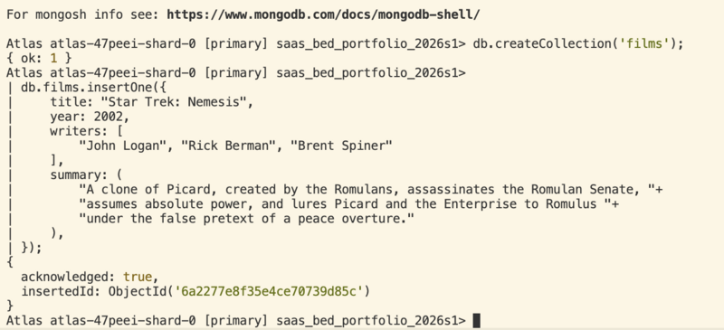


# Step 4: CRUD - Create


## 4.1 Inserting Data

- Add the supplied sample data into the films collection using a **SINGLE** MongoDB Shell COMMAND in the order provided.

Query Solution:

> ```js
> db.films.insertMany([
>     {
>         title: "My Dearest Assassin",
>         writers: ["Watthana Veerayawatthana"],
>         actors: ["Pimchanok Luevisadpaibul", "Tor Thanapob Leeratanakachorn", "Sivakorn Adulsuttiku"],
>         year: 2026,
>         running_time: 127,
>         budget: 237000000,
>         genre: ["Action", "Romance", "Thai", "Thriller", "Drama"],
>     },
>     {
>         title: "Fictionally Fake Film",
>     },
>     {
>         title: "You Cannae be Serious About a Fictional Film",
>     }
> ]);
> ```


## 4.2 Inserting Data

From the LMS, download the provided data files, and determine which one you will use to import data into the collection.

The options are: `film-data-tsv.txt`, `film-data-csv.txt`, and `film-data-json.txt`.

Using the `mongoimport` CLI command, import the data from one of the files to your collection.

What was the complete command you used to perform the import of the provided sample data?

Query Solution:

> ```bash
> mongoimport "mongodb+srv://20089460@jfm-saas-nosql.p14gskf.mongodb.net/saas_bed_portfolio_2026s1"\
>   --password="$MONGOPASS_20089460"\
>   --collection=films\
>   --jsonArray\
>   film-data.json
> ```
>
> And, to fix problems encountered in the first pass:
>
> ```js
> mongoimport "mongodb+srv://20089460@jfm-saas-nosql.p14gskf.mongodb.net/saas_bed_portfolio_2026s1"\
>   --password="$MONGOPASS_20089460"\
>   --collection=films\
>   --jsonArray\
>   additional-films.json
> ```

## 4.3 Inserting Data

Add the provided additional sample data into the films collection in the order provided.

> You do not have to add any details to the answers.md for this question.

# Step 5: CRUD - Retrieve Queries

## 5.1 Retrieve all documents

- Get all documents from the films collection.

Query Solution:

> ```js
>  db.films.find();
> ```
>


## 5.2 Retrieve all films written by…

- Get all documents with `writer` set to "`Quentin Tarantino`"

( Yields 0 results; example from Word document "James Cameron" yields 10)

Query Solution:

> ```js
> db.films.find({writers: [ "Quentin Tarantino" ]});
> db.films.find({writers: [ "James Cameron" ]});
> ```

Screen Shot:

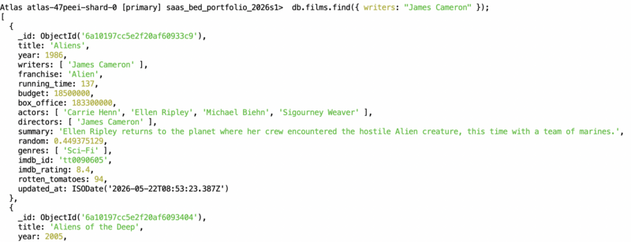


## 5.3 Retrieve films with actor(s)…

- Get all documents where `actors` include "`Brad Pitt`"

Query Solution:

> ```js
>  db.films.find({ actors: "Brad Pit" });
>  db.films.find({ actors: "Kate Winslet" });
> ```

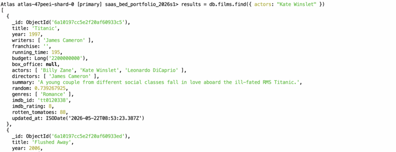


## 5.4 Retrieve films from a franchise…

- Get all documents with `franchise` set to "`The Hobbit`" (no matches in DB or import files)

Query Solution:

> ```js
>  db.films.find({franchise: "The Hobbit"});
> ```

ua
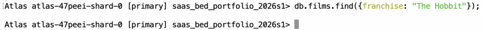

Just to compare, a screenshot of a franchise that actually has matching documents:

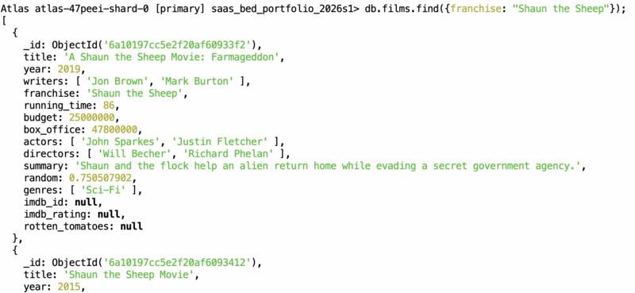


## 5.5 Retrieve films released in range…

- Get all films released between `1980` and `2020`

Query Solution:

> ```js
>  db.films.find({ year: {$gte: 1980, $lte: 2020} });
> ```

Screen Shot:

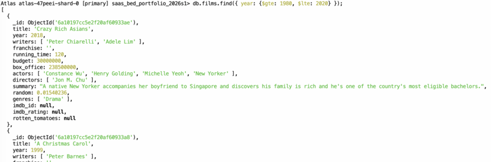


## 5.6 Retrieve films longer than…

- Get all films with a running time of over `120` minutes

Query Solution:

> ```js
>  db.films.find({ running_time: { $gt: 120 }});
> ```

Screen Shot:

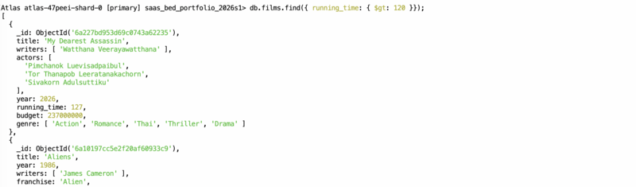

## 5.7 Retrieve films released in range…

- Get all films released after `2022`.

Query Solution:

> ```js
>  db.films.find({ year: { $gt: 2022 }});
> ```

Screen Shot:

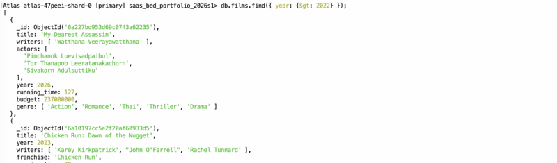


# Step 6: CRUD - Updates

## 6.1 Update document with a synopsis

- Using one or more queries, add the provided synopses to the indicated films.

| **Film** | **Synopsis** |
| --- |  --- |
| **"The Hobbit: The Desolation of Smaug"** | "The dwarves, along with Bilbo Baggins and Gandalf the Grey, continue their quest to reclaim Erebor, their homeland, from Smaug. Bilbo Baggins is in possession of a mysterious and magical ring." |
| **"The Hobbit: An Unexpected Journey"** | "A reluctant hobbit, Bilbo Baggins, sets out to the Lonely Mountain with a spirited group of dwarves to reclaim their mountain home - and the gold within it - from the dragon Smaug." |

Query Solution:

> ```js
> smaug = {
>  title: "The Hobbit: The Desolation of Smaug",
>  summary: "The dwarves, along with Bilbo Baggins and Gandalf the Grey, continue their quest to reclaim Erebor, their homeland, from Smaug. Bilbo Baggins is in possession of a mysterious and magical ring."
> }
> 
> journey = {
>  title: "The Hobbit: An Unexpected Journey",
>  summary: "A reluctant hobbit, Bilbo Baggins, sets out to the Lonely Mountain with a spirited group of dwarves to reclaim their mountain home - and the gold within it - from the dragon Smaug."
> };
> 
> for (const update of [smaug, journey]) {
>  const result = db.films.updateOne({ title: update.title }, { $set: { summary: update.summary } });
>  console.log(result);
> }
> ```

Screenshots:


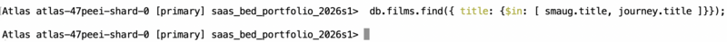

> Unfortunately, I forgot about the teams post with the additional films.
> The screenshots currently reflect the state of the collection without the additional documents
> posted on Teams, but with the following documents added manually (FIX LATER):
>
> ```js
> db.films.insertMany([
>     {
>         title: "The Hobbit: The Desolation of Smaug",
>         year: 2013,
>         franchise: "The Hobbit",
>         directors: ["Peter Jackson"],
>         writers: [
>             "Fran Walsh",
>             "Philippa Boyens",
>             "Peter Jackson",
>             "Guillermo del Toro",
>             "J.R.R. Tolkien"
>         ],
>         actors: ["Ian McKellen", "Martin Freeman", "Richard Armitage"],
>         imdb_id: "tt1170358",
>         imdb_rating: 7.8,
>     },
>     {
>         title: "The Hobbit: An Unexpected Journey",
>         year: 2012,
>         franchise: "The Hobbit",
>         directors: ["Peter Jackson"],
>         writers: ["Fran Walsh", "Philippa Boyens", "Peter Jackson"],
>         actors: ["Martin Freeman", "Ian McKellen", "Richard Armitage"],
>         imdb_id: "tt0903624",
>         imdb_rating: 7.8,
>     }
> ]);
> ```
>
> Then perform the update on the records added (see code above), to get the result:

Screenshots:

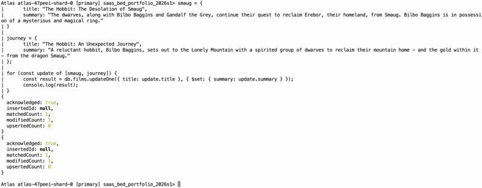

## 6.2 Update document with an actor

- Add the provided actors to the required films using one or more queries in the order provided...

| **Film Title** | **Actor** |
| --- |  --- |
| **Pulp Fiction** | Samuel L. Jackson |
| --- |  --- |
| **Star Trek VI: The Undiscovered Country** | William Shatner, Leonard Nimoy, DeForest Kelley, James Doohan, Christopher Plummer |
| **Star Trek: Nemesis** | Patrick Stewart, Jonathan Frakes, Brent Spiner, LeVar Burton, Michael Dorn, Gates McFadden, Marina Sirtis |
| **Star Trek VI: The Undiscovered Country** | Walter Koenig, Nichelle Nichols, George Takei, Kim Cattrall, David Warner |

> Were it not for the requirement that the actors be added in the order specified, I would have used `$addToSet` instead
> of `$push` to ensure that the result contained no duplicates.

Query Solution:

> ```js
>
  updates = [
    {
      title: "Pulp Fiction",
      actors: ["Samuel L. Jackson"],
    },
    {
      title: "Star Trek VI: The Undiscovered Country",
      actors: ["William Shatner", "Leonard Nimoy", "DeForest Kelley", "James Doohan", "Christopher Plummer"],
    },
    {
      title: "Star Trek: Nemesis",
      actors: [
        "Patrick Stewart", "Jonathan Frakes", "Brent Spiner", "LeVar Burton", "Michael Dorn",
        "Gates McFadden", "Marina Sirtis",
      ],
    },
    {
      title: "Star Trek VI: The Undiscovered Country",
      actors: [
        "Walter Koenig", "Nichelle Nichols", "George Takei", "Kim Cattrall", "David Warner",
      ],
    },
  ];

  var format = data => "\n" + JSON.stringify(data, null, 2);
  var reindent = text => text.replace(/\n      /g, '');

  for (const update of updates) {
    const query = { title: update.title };
    const action = { $push: { actors: { $each: update.actors } } };
    const result = db.films.updateOne(query, action);
    console.log(reindent(`
db.films.updateOne(
        ${format(query)},
        ${format(action)}
      )
      ==> ${format(result)}
    `))
  }

> db.films.updateOne(
> { title: "Pulp Fiction" },
> { $push: { actor: "Samuel L. Jackson" }}
> );
>
> db.films.updateOne(
> { title: "Star Trek VI: The Undiscovered Country" },
> {
> $push: {
>             actors: {
>                 $each: [
> "William Shatner", "Leonard Nimoy", "DeForest Kelley", "James Doohan", "Christopher Plummer"
> ]
> }
> }
> },
> );
>
> db.films.updateOne(
> { title: "Star Trek: Nemesis" },
> {
> $push: {
>             actors: {
>                 $each: [
> "Patrick Stewart", "Jonathan Frakes", "Brent Spiner", "LeVar Burton", "Michael Dorn",
> "Gates McFadden", "Marina Sirtis"
> ],
> },
> },
> },
> );
>
> db.films.updateOne(
> { title: "Star Trek VI: The Undiscovered Country" },
> {
> $push: {
>             $each: [
> "Walter Koenig", "Nichelle Nichols", "George Takei", "Kim Cattrall", "David Warner"
> ]
> }
> },
> );
>
> ```

Screen Shot:

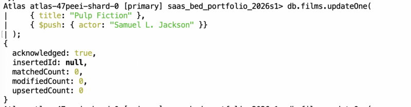
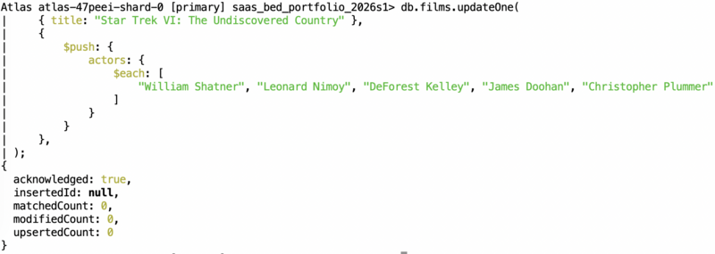
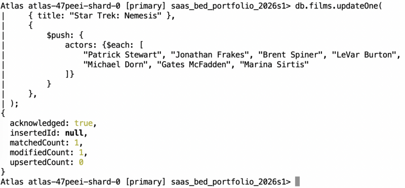
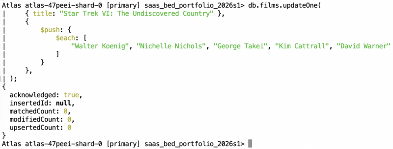


# Step 7: CRUD – Searches

Performing searches on collections.


## 7.1 Searching for titles with …

- Find all films with the `title` starting with "`T`".

Query Solution:

> ```js
>  db.films.find( {title: { $regex: "^T" } });
> ```

Screen Shot:

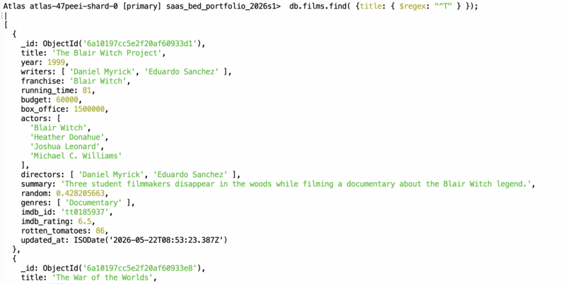


## 7.2 Searching for synopses with …

- Find all films that have a `genre` that contains the letters "`th`"

Query Solution:

> ```js
>  db.films.find({ genre: { $regex: "th" }});
> ```

Screen Shot:

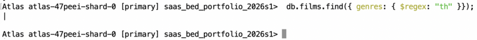

Screenshot showing genres that occur in the dataset:

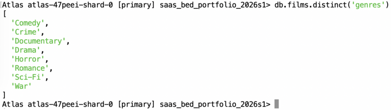

Query repeated with something that produces at least 1 result:

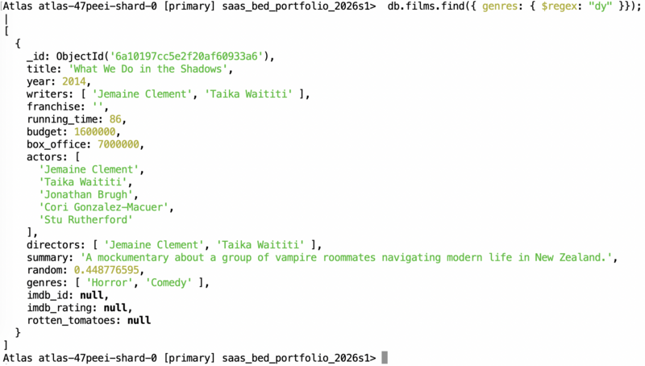


## 7.3 Searching for synopses with… and not …

- Find all films that have a `synopsis` that contains the word "`Captain`" and not the word "`Pike`"

Query Solution:

> ```js
>  db.films.find({$and: [
>     { summary: { $regex: "\\bCaptain\\b" } }, 
>     { summary: { $not: {$regex: "\\bPike\\b" } } }
> ]})
> ```
>
> (annoyingly, it is apparently possible to use "$and" on predicate-expressions when using aggregation but not search)

Screen Shot:

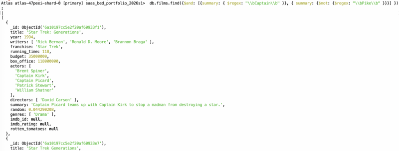


## 7.4 Searching for synopses with … or …

- Find all films that have a `synopsis` that contains the word "`London`" or "`Brooklyn`"

Query Solution:

> ```js
>  db.films.find({ summary: { $regex: "\\b(?:London|Brooklyn)\\b "} });
> 
>  // Or, no more efficiently:
> 
> db.films.find({
>     $or: [{ summary: { $regex: "\\bLondon\\b "} }, { summary: { $regex: "\\bBrooklyn\\b "} }]
> });
> ```

Screen Shot:

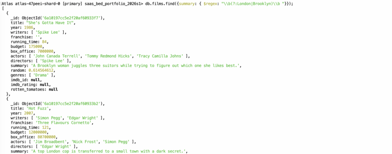


## 7.5 Searching for synopses with … and …

- Find all films that have a synopsis that contains the words "`team`" and "`search`"

Query Solution:

> ```js
>  db.films.find({ $and: [ { summary: { $regex: "\\bteam\\b" } }, { summary: { $regex: "\\bsearch\\b" } } ]})
> ```

Screen Shot:

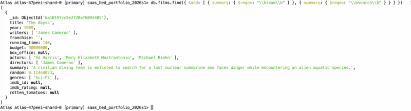


# Step 8: CRUD - Deletions

This step requires you to remove films from the collection.


## 8.1 Removing a film using its title…

- Use the title to delete the film "`Pee Wee Herman's Big Adventure`"

Query Solution:

> ```js
> // Could use either deleteOne or deleteMany
> 
>  db.films.deleteOne({
>     title: "Pee Wee Herman's Big Adventure"
>  })
> ```

Screen Shot:

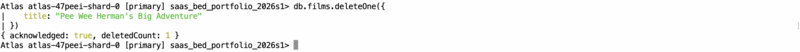


## 8.2 Remove a film by ID…

Delete the film “`Fictionally Fake Film`” by:

- Writing a query to discover the film ID
- Then using the found ID to remove the film

Query Solution:

> ```js
> result = db.films.findOne({ title: "Fictionally Fake Film"})
> db.films.deteteOne(result._id)
> ```

Screen Shot:

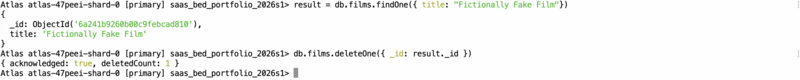


## 8.3 Removing multiple films…

- Delete any films with the exact word “`Fictional`” in their title, ignoring case.

Query Solution:

```js
 db.films.deleteMany({
    title: { $regex: /\bfictional\b/, $options: "i" }
 });
```

Screen Shot:

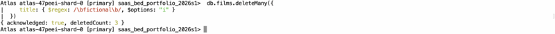


# Step 9: NoSQL Indexes

Using the films collection, create the indexes to match the following conditions:


## 9.1 Indexes for Sorting

- Create an index on the `title` field.

Query Solution:

> ```js
> db.films.createIndex({ title: 1 });
> ```


- Create an index on the `year` and `title` fields.

Query Solution:

> ```js
>  db.films.createIndex({ year: 1, title: 1 });
> ```

- Create an index on the `franchise`, `title`, `actors`, `year` fields.
- The index must be in the order year, title, actors then franchise.

Query Solution:

> ```js
>  db.films.createIndex({ year: 1, title: 1, actors: 1, franchise: 1 });
> ```


## 9.2 Indexes for Full Text Search

- Create a text index on the `title` and `summary` fields.

Query Solution:

> ```js
>  db.films.createIndex({ title: 'text', summary: 'text' });
> ```


## 9.3 Verifying Execution Plans

- Check the execution plan for a query that finds the films with a title containing “Star”.
- Check if the created index is being used.

Query Solution:

> The following will make use of the text index and filter the results to ensure that "Star"
> is contained in the title, not just the summary (the use of "executionStats" verbosity is
> suggested by Done (2023)[^done-2023])
>
> ```js
> criteriaStar1 = { title: { $regex: /\bStar\b/ } };
> criteriaStar2 = {
>     $and: [
>         { $text: { $search: "Star" } },
>         criteriaStar1
>     ]
> };
>  db.films.explain("executionStats").find(criteriaStar2)
> ```
>
> According to the results of another explain (`db.films.explain("executionStats").find(criteriaStar1)`), using
> the regex alone would still result in all titles being scanned, but only examine the index keys
> and not the documents.
> In some contexts, this could represent a considerable saving in the amount of data being processed,
> but likely not as much as reducing the number of titles examined using the full text search index.

Screen Shot:

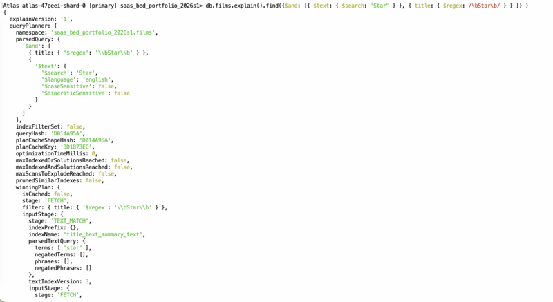

## 9.4 Differences in Indexes

- Briefly explain the differences between an index for sorting against an index for full text searches.
- Include in your answer when each is best suited for use.

> A full-text search can be used to determine if a word occurs anywhere within one or more text fields within
> a document.
> This is something that would require a full scan through all documents containing the text field(s) being searched
> using a regular-expression match, but the search space can be reduced using the full text index (as shown).
> It does not impose a useful order on the results, nor does MongoDB's implementation support prefix matching.
> In MongoDB, there is a further limitation that there can only be one full-text index per collection.
>
> Regular indexes support sorting of results in an order that matches the order of fields in the index.
> They also support range queries using either the full values for the fields or a prefix[^mongo-regex-prefix].
>
> Full-text queries useful for speeding up queries that involve finding documents containing
> one of a set of words within the fields covered by a query, a limited but important application.
> Regular indexes are far more flexible, and can be used for a variety of purposed including range searches and
> sorting.

# Step 10: Aggregation

In this step you will be aggregating data within a collection.


## 10.1 Counting documents

- Write an aggregation query to count the number of `Star Trek` films.

Query Solution:

> ```js
> db.films.aggregate([
>     { $match: { franchise: "Star Trek" } },
>     { $count: "film_count" }
> ])
> ```

## 10.2 Mean budget and box office takings…

- Write an aggregation query to calculate the average budget and box office takings.
- Display both values.

Query Solution:

> ```js
>  db.films.aggregate([
>     { $group: { _id: null, mean_budget: { $avg: "$budget" }, mean_box_office: { $avg: "$box_office" } } },
>     { $unset: [ "_id" ]}
>  ]);
> ```


## 10.3 Profit earnings

- Write an aggregation query to calculate the profit (box office – budget) for the films, showing just the film title and the profit.
- Films with no budget and/or no box office should NOT be included in the results.

Query Solution:

> ```js
>  db.films.aggregate([
>     { $match: { $expr: { $and: [ { $isNumber: "$box_office" }, { $isNumber: "$budget" } ] } } }, 
>     { $set: { profit: { $subtract: [ "$box_office", "$budget" ] } } }, 
>     { $project: { _id: 0, title: "$title", profit: "$profit" } }
> ])
> ```

Screen Shot:

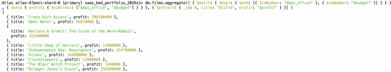


## 10.4 Grouping data

- Write the query to group films by their franchise and count the number of films in each franchise.

Query Solution:

> ```js
>  db.films.aggregate([
>     { $group: { _id: "$franchise", count: { $sum: 1 } } },
>     { $sort: { count: -1 }}
>  ]);
> ```


# Step 11: Triggers

Using the films collection, we are now going to create triggers to provide an audit trail for when data is added, updated or deleted.

## 11.1 Create trigger for inserted data

- Create a trigger that monitors the films collection for new data being added.

Query Solution:

> ```js
> // This code is adapted from the default function provided when creating a trigger.
> 
> exports = async function(changeEvent) {
>   // Documentation on ChangeEvents: https://docs.mongodb.com/manual/reference/change-events/
>   
>   const serviceName = "JFM-SaaS-NoSQL";
>   const databaseName = changeEvent.ns.db;
>   const database = context.services.get(serviceName).db(databaseName);
>   const audit = database.collection("film_audit");
> 
>   // Get the "FullDocument" present in the Insert/Replace/Update ChangeEvents
>   try {
>     // The event should always be "insert" for this trigger, but check anyway.
>     if (changeEvent.operationType === "insert") {
>       await audit.insertOne({
>         action: "INSERT",
>         action_date: changeEvent.clusterTime, // better to use wallTime?
>         original_data: changeEvent.fullDocument,
>       });
>     }
>   } catch(err) {
>     console.log("error performing mongodb write: ", err.message);
>   }
> };
> 
> ```


## 11.2 Testing the insert trigger works correctly

- Use the following data to check the trigger functions as expected:

Query Solution:

```js
// Insert some data now that the trigger has been added
db.films.insertOne({
   title: "Jeffrey", 
   writers: ["Paul Rudnick"], 
   year: 1995, 
   actors: ["Sigourney Weaver", "Patrick Stewart", "Michael T. Weiss", "Steven Weber", "Bryan Batt"], 
   box_office: 3500000, 
   running_time: 92
});

// Show all additions to the audit log
db.film_audit.find()
```


## 11.3 Create trigger for updated data

- Create a trigger that monitors the films collection for new data being added.

Query Solution:

> Note that this handles update operations, not replace.
>
> ```js
>  db.films.find();// This code is adapted from the default function provided when creating a trigger.
> 
> exports = async function(changeEvent) {
>   // Documentation on ChangeEvents: https://docs.mongodb.com/manual/reference/change-events/
>   
>   const serviceName = "JFM-SaaS-NoSQL";
>   const databaseName = changeEvent.ns.db;
>   const database = context.services.get(serviceName).db(databaseName);
>   const audit = database.collection("film_audit");
> 
>   // Get the "FullDocument" present in the Insert/Replace/Update ChangeEvents
>   try {
>     // The event should always be "insert" for this trigger, but check anyway.
>     if (changeEvent.operationType === "update") {
>       await audit.insertOne({
>         action: "UPDATE",
>         action_date: changeEvent.clusterTime, // better to use wallTime?
>         original_data: changeEvent.fullDocumentBeforeChange,
>         data: changeEvent.fullDocument,
>       });
>     }
>   } catch(err) {
>     console.log("error performing mongodb write: ", err.message);
>   }
> };
> ```

Screen Shot:

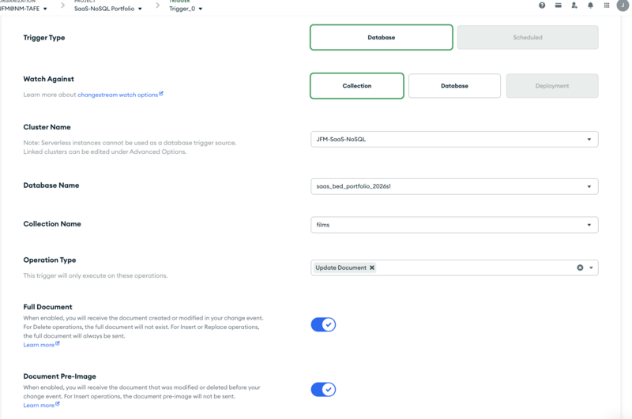
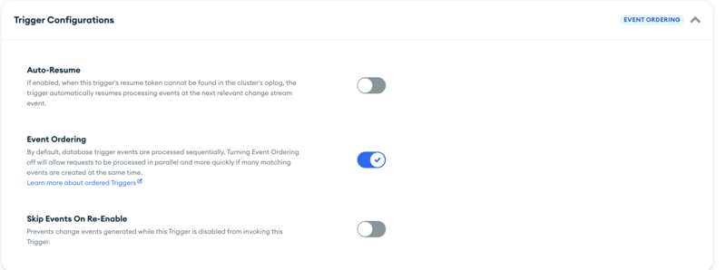


## 11.4 Testing the update trigger works correctly

- Use the following data to verify that the trigger functions as expected. Make sure that these updates are completed in more than one query:

Update 1:

| Field        | Value           |
|--------------|----------------:|
| Budget       | $237 million    |
| Running time | 162 minutes     |
| Box office   | $2.923 billion  |
| Franchise    | Avatar          |

Update 2:

Add to Actors: Sam Worthington, Zoe Saldana, Stephen Lang, Michelle Rodriguez, Sigourney Weaver

Query Solution:

> My first attempt at setting up the trigger failed due to me putting in the wrong cluster name,
> but the data was already updated top match what was required from update 1.
> The solution that I adopted was to change the franchise to "Avatar!" before testing, to make sure that
> the before and after documents really were different.
>
> Given that Worthington, Saldana and Weaver account for the current list of actors, I have chosen
> to replace the list rather than pushing new items.
>

```js
 last_update = db.film_audit.aggregate([
   { $match: { action: "UPDATE" } }, 
   { $group: { _id: "all", max_date: { $max: "$action_date" } } },
 ]).toArray();
 last_timestamp = last_update.length > 0 ? last_update[0].max_date : Timestamp(0, 0);

 result = db.films.updateOne(
  { title: "Avatar" },
  {
    $set: {
      actors: [ "Sam Worthington", "Zoe Saldana", "Stephen Lang", "Michelle Rodriguez", "Sigourney Weaver" ],
    },
  }
 );

 console.log(result);
 console.log("Waiting for audit log to update (5s)");

 sleep(5000);

 audit_entry = db.film_audit.findOne({ action: "UPDATE", action_date: { $gt: last_timestamp }})
```

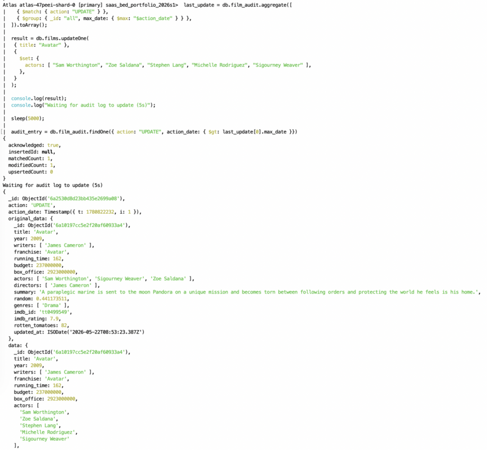


## 11.5 Create trigger for deleted data

- Create a trigger that monitors the films collection for new data being added.

Query Solution:

> ```js
> exports = async function(changeEvent) {
>   // ChangeEvents: https://www.mongodb.com/docs/manual/reference/change-events
> 
>   const serviceName = "JFM-SaaS-NoSQL";
>   const databaseName = "saas_bed_portfolio_2026s1";
>   const audit = context.services.get(serviceName).db(databaseName).collection("film_audit");
> 
>   try {
>     if (changeEvent.operationType === "delete") {
>       await audit.insertOne({
>         action: "DELETE",
>         action_date: changeEvent.clusterTime, // better to use wallTime?
>         original_data: changeEvent.fullDocumentBeforeChange,
>       });
>     }
>   } catch(err) {
>     console.log("error performing mongodb write: ", err.message);
>   }
> };
> ```


## 11.6 Testing the delete trigger works correctly

- Use the following conditions to verify that the trigger functions as expected:

Query Solution:

```js
 db.films.insertOne({ title: "A Real Dummy" });
 sleep(1000);

 last_delete = db.film_audit.aggregate([
   { $match: { action: "DELETE" } }, 
   { $group: { _id: "all", max_date: { $max: "$action_date" } } },
 ]).toArray();
 last_timestamp = last_delete.length > 0 ? last_delete[0].max_date : Timestamp(0, 0);

 response = db.films.deleteMany({ title: { $regex: /\bDummy\b/ } });

 console.log(response);
 console.log("Waiting for audit log to update (5s)");

 sleep(2000);

 audit_entry = db.film_audit.findOne({ action: "DELETE", action_date: { $gt: last_timestamp }});
```

## 11.7 Verify the log contains data…

- Write a query to show the data in the film audit log.

Query Solution:

```js
 db.film_audit.find();
```

Screen Shot:


# Step 12: Submission

What is the URL for your GitHub (or equivalent) repository for this assessment?

```text
https://github.com/jofish920/jfm-ict50220-saas-2-bed-nosql-2026-s1.git
```

# References

[^done-2023]: Done, P (2023) _Practical MongoDB Aggregations_.  Ebook. <https://www.practical-mongodb-aggregations.com/>

[^laravel-13-docs]: Laravel Team. (n.d.). Documentation (Version 13.x). [Online documentation]. <https://laravel.com/docs/13.x>

[^mongo-field-names]: Morgan, A (2025, Sep 3) _The Difference a (Field) Name Makes: Reduce Document Size and Increase Performance_. Blog post. <https://www.mongodb.com/company/blog/technical/difference-field-name-makes-reduce-document-size-increase-performance>

[^mongo-regex-prefix]: MongoDB (n.d.) \$regex (query predicate operator).  Page in MongoDB Online Documentation. <https://www.mongodb.com/docs/manual/reference/operator/query/regex/>


# Cited

The options that I currently have set in VS Code have a tendency to prune "unused" footnotes.
Including all references here as well as in the body of the response is a temporary workaround
to eliminate the possibility of the editor eating my references (again).

[^done-2023]
[^laravel-13-docs]
[^mongo-field-names]
[^mongo-regex-prefix]

# END


